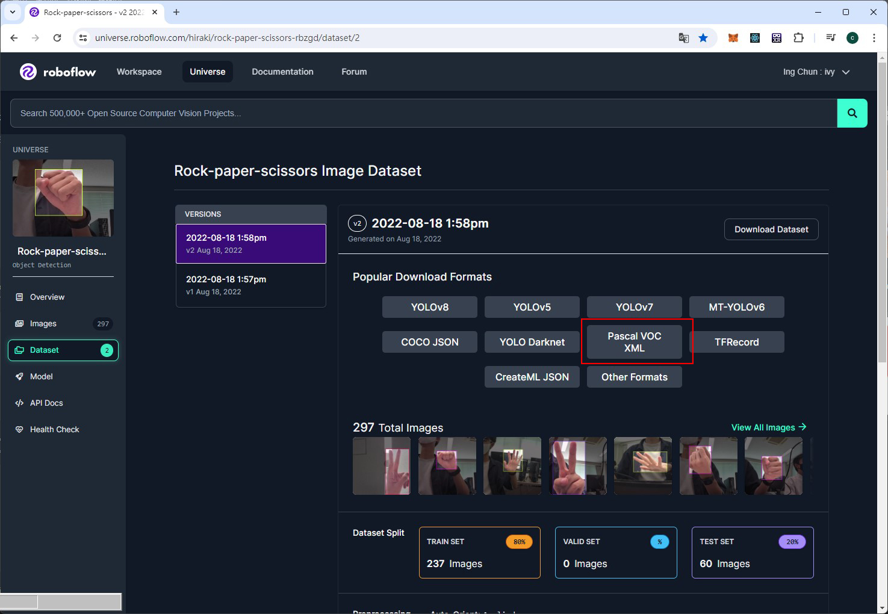

-虛擬環境安裝-  
 
1->環境變數  
C:\Users\C4\AppData\Local\Programs\Python\Python312\Scripts  
C:\Users\C4\AppData\Local\Programs\Python\Python312  
  
2->安裝virtualenv  
pip install virtualenv  
virtualenv 取一個名稱  
  
3->啟動  
到虛擬環境Scripts目錄中啟動  
activate  
  
-相關-  
virtualenv->virtualenv -p python3.10 XXX  
sqlitebrowser->https://sqlitebrowser.org/dl/  
Tesseract->https://tesseract-ocr.github.io/tessdoc/Installation.html  
PaddleOCR->https://github.com/PaddlePaddle/PaddleOCR/blob/main/doc/doc_ch/quickstart.md  
EasyOCR->https://github.com/JaidedAI/EasyOCR  
Mediapipe->https://github.com/googlesamples/mediapipe  
line_develop->https://developers.line.biz/zh-hant/  
ngrok->https://ngrok.com/  
Java JDK->https://www.oracle.com/tw/java/technologies/downloads/  
Google Cloud Platform->https://console.cloud.google.com/welcome?hl=zh-TW&project=mymap-315901  
選擇 Google Sheet API 啟用  
剪刀石頭布(rock-paper-scissors)，資料集->https://universe.roboflow.com/hiraki/rock-paper-scissors-rbzgd/dataset/2  
smeshariks集料集->https://universe.roboflow.com/khalina/smeshariks/dataset/2  

-目錄-  
>01->Tesseract-OCR、EasyOCR、PaddleOCR with OpenCV  
>02->Mediapipe  
>>0201->image_classification  
>>0202->image_embedder  
>>0203->image_segmentation  
>>0204->interactive_segmenter  
>>0205->Object Detection  
>>0206->Pose Landmarks Detection  

>03->customization  
>04->tabula-py  
>05->Mediapipe  
>>0501->face_detector  
>>0502->face_landmarker  
>>0503->face_stylizer  
>>0504->Gesture Recognizer  
>>0505->hand_landmarker  
>>0506->text_classifier  
>>0507->Pose Landmarks from video  

>06->save to sqlite  
>07->save to google sheets  
>08->save to webpage  
>09->save to webpage  
>10->save to webpage  
>11->save to linebot  
